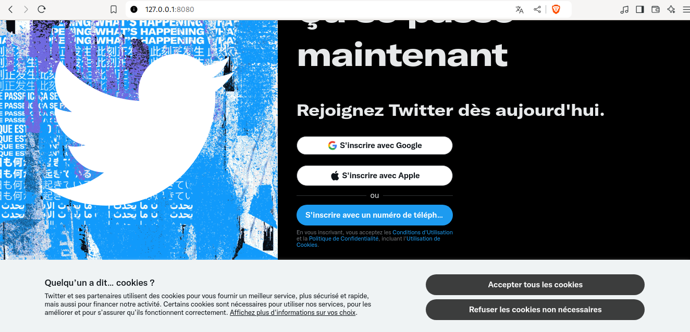

# Simple HTTP Server in C

This repository contains a simple HTTP server implemented in C. The server is designed to serve static HTML and CSS files. You can use this server to host multiple sites by configuring the `conf.txt` file.

## Features

- Serve static files (HTML, CSS) over HTTP.
- Easy configuration to specify different sites and paths.
- Default configuration for quick setup.

## Getting Started

Follow these steps to get the server up and running:

### 1. Clone the Repository

```bash
git clone https://github.com/Nebton/NE302.git
```
### 2. Navigate to the Project Directory
```bash
cd NE302/http
```
### 3. Build the Server
```bash
make
```
### 4. Run the Server
```bash
make run
```

### 5. Configure the Server
By default, the server comes with three example sites located in the NE302/sitex/ directory. To configure your own sites:

1. Create a New Folder: Create a folder for your site and place your HTML and CSS files in it.

2. Update the Configuration File: Edit the conf.txt file to specify the IP address and path of your site. The conf.txt file follows this format:

```bash
http://127.0.0.1
/path/to/your/site1/
http://127.0.0.2
/path/to/your/site2/
http://127.0.0.3
/path/to/your/site3/
```
The paths in the conf.txt file should be absolute or relative to the project root.

### 6. Access Your Sites
Once the server is running, you can access your sites by navigating to the configured IP addresses in your web browser.

### 7. Example
By navigating to 127.0.0.1 on your browser, you will see an (old) Twitter login page.

<div style="text-align: center;">
  
</div>
